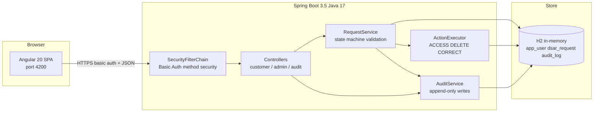
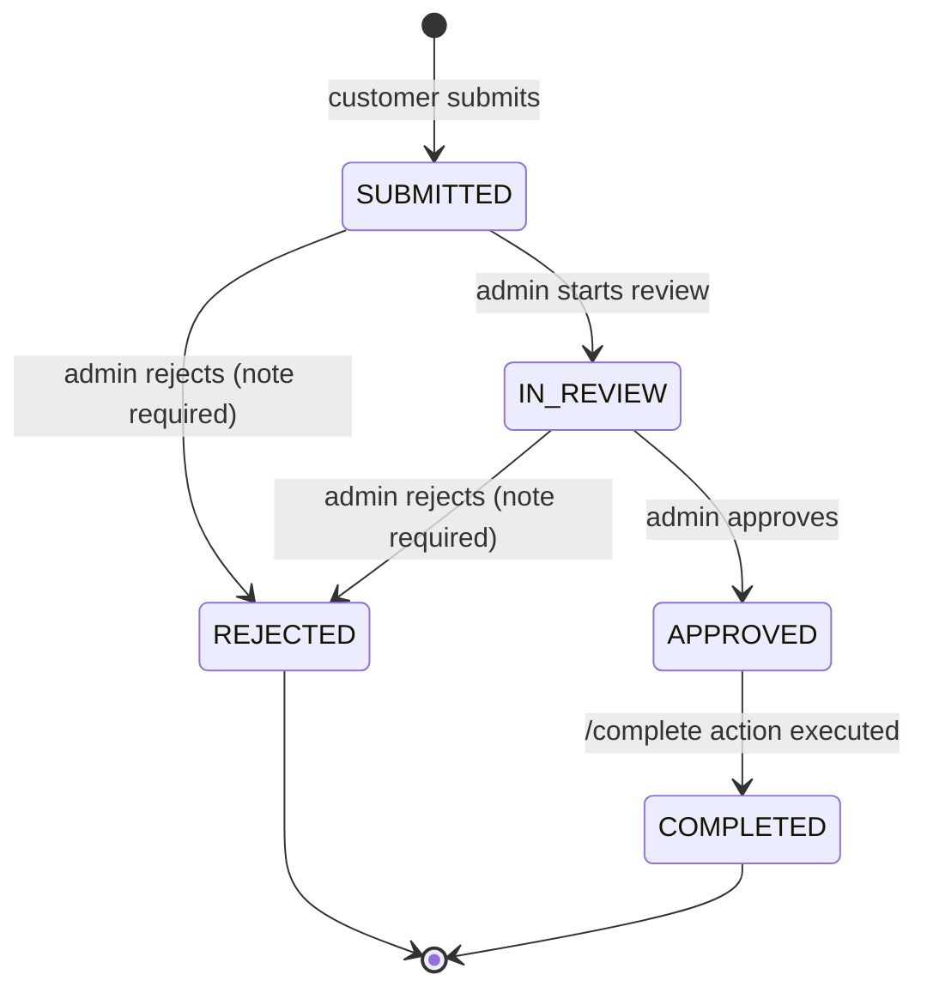
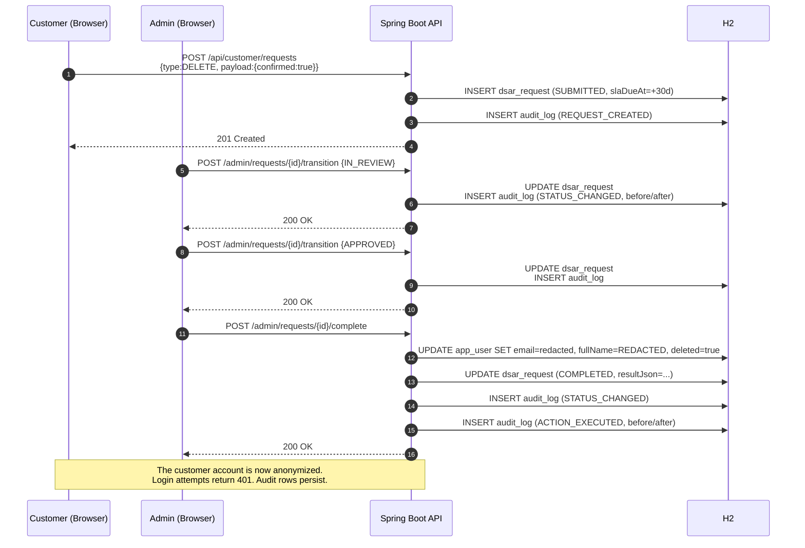

# DSAR Portal — MVP

An automated **Data Subject Access Request** portal aligned with **GDPR Articles 15, 16 and 17**. Customers submit privacy requests (Access / Delete / Correct). Admins process them through a state machine. Every significant action lands in an **append-only audit trail**.

> **POC built to the client brief:** Spring Boot + Java 17 backend, Angular frontend, HTTP Basic Auth with role determination, in-memory (H2) datastore. AI-assisted development is encouraged by the brief — see the [AI-Assisted Development](#ai-assisted-development) section for how it was used here.

---

## Contents

- [Quick start](#quick-start)
- [Demo credentials](#demo-credentials)
- [Demo script](#demo-script)
- [Architecture](#architecture)
- [State machine](#state-machine)
- [Sequence: DELETE request end-to-end](#sequence-delete-request-end-to-end)
- [Data model](#data-model)
- [API surface](#api-surface)
- [Security model](#security-model)
- [Tests](#tests)
- [Project structure](#project-structure)
- [Architectural decisions](#architectural-decisions)
- [AI-Assisted Development](#ai-assisted-development)
- [Known gaps & production roadmap](#known-gaps--production-roadmap)

---

## Quick start

### Prerequisites
- **JDK 17+** (project compiles to Java 17 bytecode; any 17+ JDK works)
- **Node.js 20+**
- **Maven 3.9+** (optional — `./mvnw` wrapper is included)

### Run the backend
```bash
cd backend
mvn spring-boot:run
# or: ./mvnw spring-boot:run
```
- API:         http://localhost:8080
- Swagger UI:  http://localhost:8080/swagger-ui.html
- H2 console:  http://localhost:8080/h2-console  (JDBC URL: `jdbc:h2:mem:dsardb`, user `sa`, empty pw)
- Health:      http://localhost:8080/health

### Run the frontend
```bash
cd frontend
npm install        # first time only
npm start          # → http://localhost:4200
```

### Run with Docker (optional)
```bash
docker compose up --build
```

### Run tests
```bash
cd backend
mvn test
```
Currently 3 test classes, 20+ assertions:
- [`DsarStatusTest`](backend/src/test/java/com/dsar/portal/request/DsarStatusTest.java) — state-machine unit tests (legal + illegal + terminal)
- [`SecurityIntegrationTest`](backend/src/test/java/com/dsar/portal/security/SecurityIntegrationTest.java) — role enforcement through the real filter chain
- [`RequestLifecycleIntegrationTest`](backend/src/test/java/com/dsar/portal/request/RequestLifecycleIntegrationTest.java) — full CORRECT lifecycle + audit row assertions + guard rails

---

## Demo credentials

The [`DataSeeder`](backend/src/main/java/com/dsar/portal/config/DataSeeder.java) seeds three users on every startup:

| Role     | Email               | Password      |
|----------|---------------------|---------------|
| Admin    | `admin@demo.io`     | `admin123`    |
| Customer | `customer@demo.io`  | `customer123` |
| Customer | `jane@demo.io`      | `jane123`     |

---

## Demo script

A 3-minute tour that touches every feature:

1. **Log in as customer** (`customer@demo.io`) → lands on "My Requests" (empty initially)
2. **Submit a new CORRECT request** — pick "Correct", enter a new full name → redirects back with the request in SUBMITTED status and a **green SLA badge** (29 days remaining)
3. **Submit a second ACCESS request** — just pick "Access", optional note
4. **Log out, log in as admin** (`admin@demo.io`) → lands on the queue with both requests visible, sorted by SLA
5. **Click the CORRECT request** → detail page. Click **Start review** → status chip updates to IN_REVIEW. Click **Approve** → APPROVED. Click **Complete & execute CORRECT** → the confirm dialog explains what will happen → confirm → status becomes COMPLETED and the "Execution result" card appears with `kind: USER_CORRECTED`, before/after.
6. **Scroll to the Audit trail card** on the same page → **5 append-only rows** (REQUEST_CREATED, STATUS_CHANGED ×3, ACTION_EXECUTED) with expandable before/after JSON
7. **Click Audit Log in the sidebar** → full filterable audit with 15+ rows including login events and seed events
8. **Back to queue, do the ACCESS request** — walk through the same lifecycle → click Complete & execute → an export is generated
9. **Log back in as the customer** → the completed ACCESS request now has an **Export** button → downloads `dsar-export-<id>.json`
10. **Try to reject a new request without a note** — the dialog's "Confirm" button stays disabled until you type a justification (also enforced server-side)

---

## Architecture



**Package layout**

```
com.dsar.portal
├── config          SecurityConfig, DataSeeder, OpenApiConfig
├── audit           AuditLog (@Immutable), AuditService, AuditController, AuditSearchSpec
├── user            User, UserRepository, Role
├── request
│   ├── DsarRequest, DsarStatus (state machine), DsarType
│   ├── RequestService, ActionExecutor
│   ├── controller  CustomerRequestController, AdminRequestController
│   └── dto
├── security        AppUserPrincipal, AppUserDetailsService, AuthController, AuthAuditListener
└── common          ApiException, GlobalErrorHandler, HealthController
```

---

## State machine

Enforced both in [`DsarStatus.canTransitionTo`](backend/src/main/java/com/dsar/portal/request/DsarStatus.java) (unit-tested in [`DsarStatusTest`](backend/src/test/java/com/dsar/portal/request/DsarStatusTest.java)) and at the API layer in [`RequestService.transition`](backend/src/main/java/com/dsar/portal/request/RequestService.java). The UI surfaces only legal next states per status.



`COMPLETED` is reached via a dedicated `/complete` endpoint (not `/transition`) because it has **side effects**: it triggers [`ActionExecutor`](backend/src/main/java/com/dsar/portal/request/ActionExecutor.java) which produces the ACCESS export, or anonymizes the user, or applies the CORRECT patch. Separating the endpoints makes the side-effect boundary explicit.

---

## Sequence: DELETE request end-to-end



---

## Data model

| Entity        | Key fields                                                                                     | Notes                                                                     |
|---------------|------------------------------------------------------------------------------------------------|---------------------------------------------------------------------------|
| `app_user`    | id (UUID), email UNIQUE, passwordHash, fullName, role, createdAt, deleted, version             | BCrypt hashes; soft-delete via `deleted=true` for audit integrity         |
| `dsar_request`| id, requesterId → user, type, status, payloadJson, resultJson, assignedAdminId, slaDueAt, version | Optimistic locking via `@Version` prevents lost updates on concurrent admin actions |
| `audit_log`   | id, actorId, actorRole, action, entityType, entityId, beforeJson, afterJson, ipAddress, ts     | `@Immutable` — no update/delete path in the code                          |

---

## API surface

10 endpoints, all documented in Swagger UI. Grouped by tag:

| Method | Path                                      | Role     | Purpose                                       |
|--------|-------------------------------------------|----------|-----------------------------------------------|
| GET    | `/health`                                 | public   | Liveness probe                                |
| GET    | `/api/auth/whoami`                        | any      | Return current identity & role                |
| POST   | `/api/customer/requests`                  | CUSTOMER | Submit a DSAR                                 |
| GET    | `/api/customer/requests`                  | CUSTOMER | List my requests                              |
| GET    | `/api/customer/requests/{id}`             | CUSTOMER | Get one of my requests                        |
| GET    | `/api/customer/requests/{id}/export`      | CUSTOMER | Download my ACCESS export (JSON attachment)   |
| GET    | `/api/admin/requests`                     | ADMIN    | Search queue (filter: type, status, paged)    |
| GET    | `/api/admin/requests/{id}`                | ADMIN    | Fetch request (writes `RECORD_ACCESSED` audit) |
| POST   | `/api/admin/requests/{id}/transition`     | ADMIN    | Move through state machine                    |
| POST   | `/api/admin/requests/{id}/complete`       | ADMIN    | Execute action + mark COMPLETED               |
| GET    | `/api/admin/audit`                        | ADMIN    | Search audit log (filter by action / entity / actor / time) |

A [Postman collection](DSAR-Portal.postman_collection.json) is checked in — import it and the seeded credentials are pre-configured.

---

## Security model

| Concern              | Implementation                                                                 |
|----------------------|--------------------------------------------------------------------------------|
| Authentication       | HTTP Basic via [`SecurityConfig`](backend/src/main/java/com/dsar/portal/config/SecurityConfig.java) + [`AppUserDetailsService`](backend/src/main/java/com/dsar/portal/security/AppUserDetailsService.java); stateless sessions |
| Password storage     | `BCryptPasswordEncoder(10)`                                                    |
| Authorization        | URL rules (`/api/customer/**` → CUSTOMER, `/api/admin/**` → ADMIN) + method-level `@PreAuthorize` on each controller class |
| IDOR prevention      | Customer endpoints always filter by `authentication.principal.id` (see `findByIdAndRequesterId`) |
| CSRF                 | Disabled — the API is stateless Basic Auth with no cookies                     |
| CORS                 | Whitelisted to `http://localhost:4200` in dev                                  |
| Audit integrity      | `AuditLog` is `@Immutable`, no UPDATE/DELETE endpoints exist; enforced in tests |
| Role enforcement test| [`SecurityIntegrationTest`](backend/src/test/java/com/dsar/portal/security/SecurityIntegrationTest.java) drives the real filter chain |
| Error handling       | [`GlobalErrorHandler`](backend/src/main/java/com/dsar/portal/common/GlobalErrorHandler.java) emits clean JSON with proper status codes; no stack traces leak |
| Login audit          | [`AuthAuditListener`](backend/src/main/java/com/dsar/portal/security/AuthAuditListener.java) captures both success and failure via Spring Security events |
| Admin record access  | `/api/admin/requests/{id}` writes a `RECORD_ACCESSED` row — GDPR Article 30 accountability |

---

## Tests

```bash
cd backend && mvn test
```

| Test class                         | What it proves                                            |
|-----------------------------------|-----------------------------------------------------------|
| `DsarStatusTest`                   | State-machine graph — 5 legal transitions, 16 illegal ones, terminal states |
| `SecurityIntegrationTest`          | Public `/health`; 401 anon; role enforcement on customer & admin endpoints; bad password → 401; unknown route → 404 |
| `RequestLifecycleIntegrationTest`  | Full CORRECT lifecycle end-to-end; 5 audit rows appended with expected actions; illegal transitions → 409; rejection without note → 400; export gated on COMPLETED; CORRECT on `email` → 400; DELETE without `confirmed:true` → 400 |

---

## Project structure

```
DSAR/
├── PRD.md                             Product Requirements Document (phased delivery plan)
├── README.md                          this file
├── docker-compose.yml
├── DSAR-Portal.postman_collection.json
├── backend/
│   ├── pom.xml
│   ├── Dockerfile
│   ├── src/main/java/com/dsar/portal/ (packages listed above)
│   ├── src/main/resources/application.yml
│   └── src/test/java/com/dsar/portal/ (3 test classes)
└── frontend/
    ├── package.json
    ├── angular.json
    ├── Dockerfile + nginx.conf
    └── src/app/
        ├── core/       AuthService, AuthGuard, RequestService, AdminRequestService, AuditService, models
        ├── shared/     SlaBadge, StatusChip, TypeChip, AuditRow, ConfirmDialog
        └── features/
            ├── auth/       LoginComponent
            ├── customer/   MyRequestsComponent, NewRequestComponent
            ├── admin/      AdminQueueComponent, RequestDetailComponent, TransitionDialog, AuditLogComponent
            ├── shell/      CustomerShell, AdminShell
            └── shared/     ForbiddenComponent
```

---

## Architectural decisions

A deliberate decision log for the review call.

**Why a state machine on `DsarStatus` instead of a free `status` field?**
Privacy requests are a compliance surface. Letting any admin push any status to any other is a bug generator. The enum knows its legal successors; the service enforces it; the UI only offers valid actions. Unit-tested in [`DsarStatusTest`](backend/src/test/java/com/dsar/portal/request/DsarStatusTest.java).

**Why two separate endpoints, `/transition` and `/complete`?**
`/transition` is pure state management (cheap, idempotent-ish, no side effects). `/complete` has irreversible side effects (export / anonymize / patch). Splitting them gives a clean conceptual boundary, makes the audit rows easy to read (two distinct kinds of audit entry), and would let us wrap `/complete` in extra gates (e.g. 2-person approval) without disturbing the state machine.

**Why append-only audit (`@Immutable`) rather than a trigger or event sourcing?**
We need tamper evidence with minimal dev ceremony. `@Immutable` + no UPDATE/DELETE endpoints is the 80/20 solution. Production hardening would add a hash chain or write-once storage; the data model already carries everything needed for that.

**Why anonymize instead of hard-delete on DELETE requests?**
GDPR Article 17 requires erasure of personal data, but compliance auditors also need proof the request was honored. We redact identifying fields (`email` → synthetic, `fullName` → "REDACTED", `deleted=true`) but keep the user row's UUID so the audit trail remains coherent. `isEnabled()` returns `false`, so logins fail.

**Why optimistic locking (`@Version`) on `DsarRequest` and `User`?**
If two admins both try to approve the same request simultaneously, the second write fails with `OptimisticLockException` rather than silently winning. Cheap to add, cheap to explain.

**Why H2 in-memory rather than file or Postgres?**
Mandated by the brief. Migration path to Postgres: swap the JDBC URL + driver in `application.yml` and add Flyway migrations (nothing in the code is H2-specific). I purposely avoided Hibernate DDL bleeding into production — the entity annotations are portable.

**Why Basic Auth rather than OAuth2 / JWT?**
Mandated by the brief. Migration path: introduce `SecurityFilterChain` profiles — a `basic` one for dev and an `oauth2` one for prod using the same `AppUserPrincipal` — most of the codebase (`@PreAuthorize`, `@AuthenticationPrincipal`) is agnostic.

**Why Angular Material rather than a custom design system?**
Time to competency. Material gives us accessible forms, dialogs, tables, toolbars, and a consistent visual language for zero design cost. The chip/badge components ([`SlaBadge`](frontend/src/app/shared/sla-badge.component.ts), [`StatusChip`](frontend/src/app/shared/status-chip.component.ts), [`TypeChip`](frontend/src/app/shared/type-chip.component.ts)) are custom because they encode business rules (SLA colouring by days remaining, status colour by lifecycle position) that generic components can't express.

**Why standalone components + lazy loading?**
Modern Angular (v14+) idiom. Every route uses `loadComponent` so the login bundle doesn't pull in admin code the customer will never see. Verified in `ng build --configuration=development` output — 14 lazy chunks.

**Why signals over RxJS `BehaviorSubject` for UI state?**
Signals (Angular 17+) are the native primitive for component-local state now. Template expressions read them directly without `| async`, and they compose via `computed(...)`. RxJS is still used for HTTP (the right tool for asynchronous flows).

---

## AI-Assisted Development

The client brief explicitly encourages AI-assisted code generation. This project used **Claude Code** throughout.

### What the AI generated (scaffolding & boilerplate)
- Spring Boot project generation (Spring Initializr template)
- Angular CLI project + Material setup
- JPA entity boilerplate (getters/setters via Lombok, constructors, indexes, table annotations)
- DTO records and mapping
- Reactive form controls with dynamic validators
- Material table column definitions, chip components
- JUnit + MockMvc test scaffolding
- Mermaid diagrams in this README
- JavaDoc / TypeDoc comments

### What I directed specifically (architecture & rules)
- **Phased delivery plan** — split into 7 phases, each ending in a committable, demonstrable state (see [`PRD.md`](PRD.md))
- **State-machine semantics** — encoded in an enum with a static transition map, and cross-verified in three places (enum, service, UI) to avoid drift
- **Separation of `/transition` vs `/complete`** — state change vs side-effect boundary
- **Audit model** — append-only + `@Immutable`, actor/role snapshotted (not FK'd, so deleting users doesn't wipe history), `before/after` stored as JSON strings
- **GDPR-aligned semantics** — anonymize-not-hard-delete; admin reads write a `RECORD_ACCESSED` row; 30-day SLA clock; rejection requires justification
- **Security posture** — role rules at both URL and method level; IDOR prevention via requester-scoped repo queries; customer sees only own data
- **Test strategy** — meaningful tests (state machine, security, full lifecycle + audit) rather than chasing coverage numbers

### How I validated the AI's output
- Every controller and service was test-covered before moving on (tests written in the same phase, not after)
- Every compile + build was run and any warning investigated (e.g. the unused-import warnings we fixed)
- API smoke-tested with curl after each phase (see phase summaries in commit history) before building the UI on top
- Schema changes always paired with a backend restart and manual verification via H2 console or Swagger UI

### What I'd do differently given more time
- Add a CI GitHub Actions workflow: build + test on PR
- Add an Apache Bench / smoke performance test for the queue endpoint
- Add a `dev` vs `prod` Spring profile to lock down H2 console and Swagger in prod
- Write 3-5 Angular component tests (Karma/Jasmine) covering `AuthGuard`, `SlaBadge`, and the dynamic `NewRequestComponent` form

---

## Known gaps & production roadmap

A non-exhaustive list of items explicitly scoped **out** for the POC:

| Gap                                          | Production plan                                                              |
|----------------------------------------------|------------------------------------------------------------------------------|
| Basic Auth only                              | OAuth2 / OIDC with MFA; `AppUserPrincipal` abstracts identity                |
| H2 in-memory                                 | Postgres + Flyway migrations (flip `spring.datasource.url` + driver)         |
| No email/webhook notifications               | Outbox pattern → SES/SendGrid; customer email on status change               |
| No rate-limiting                             | Resilience4j or bucket4j on `/api/customer/**` (abuse / enumeration)         |
| Audit rows not hash-chained                  | Append a cryptographic hash of the prior row → tamper-evident chain          |
| No CSV export for admins                     | Add a `/api/admin/audit.csv` endpoint for compliance evidence                |
| No SLA breach background job                 | `@Scheduled` sweeper + Slack/email notification when a request is within 3 days |
| Seeded users only                            | Add public self-signup + email verification                                  |
| No request withdrawal                        | Allow customer-initiated withdrawal while status = SUBMITTED                 |
| Single-tenant                                | Multi-tenant via an `org_id` discriminator + row-level filtering             |
| No CI                                        | GitHub Actions: `mvn test` + `ng test` + build on every PR                   |

---

*Built by Abhijith Krishna Ravuri for a technical assessment. The goal is to demonstrate defensible engineering judgment under time constraints.*
